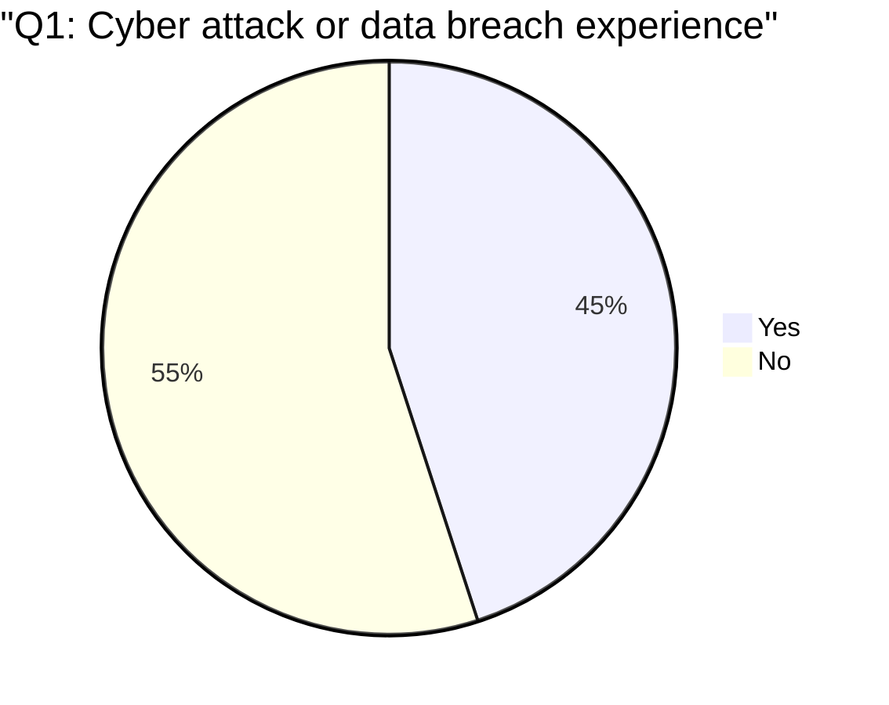
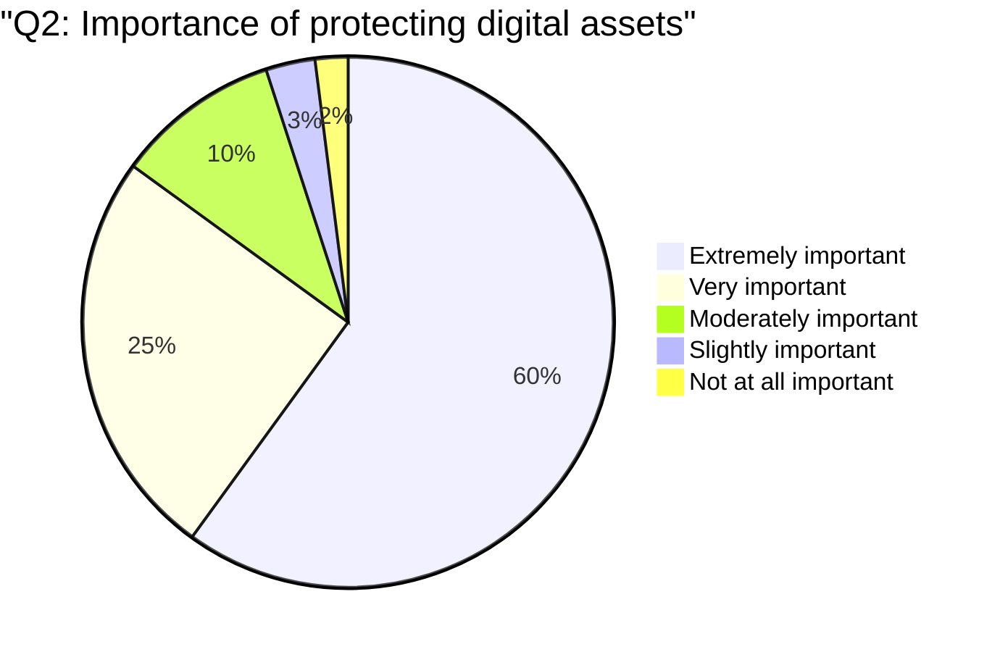
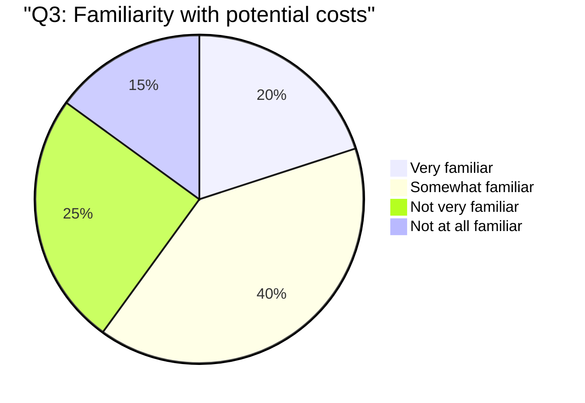
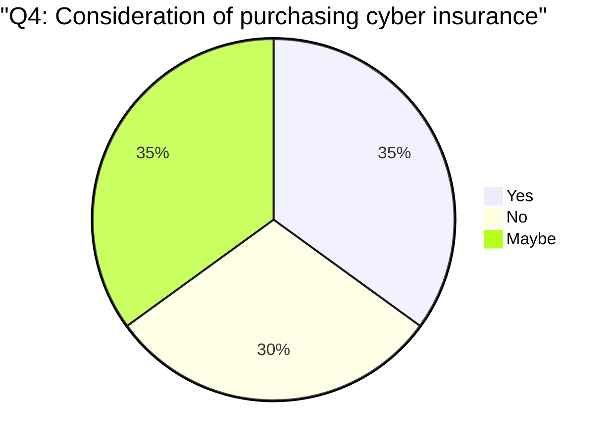
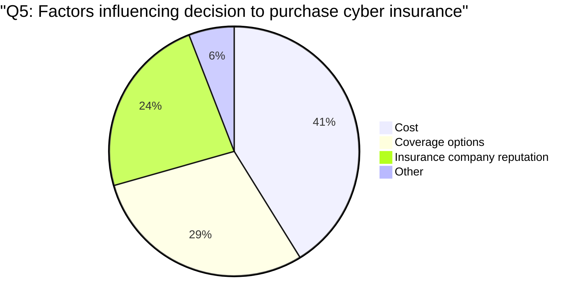
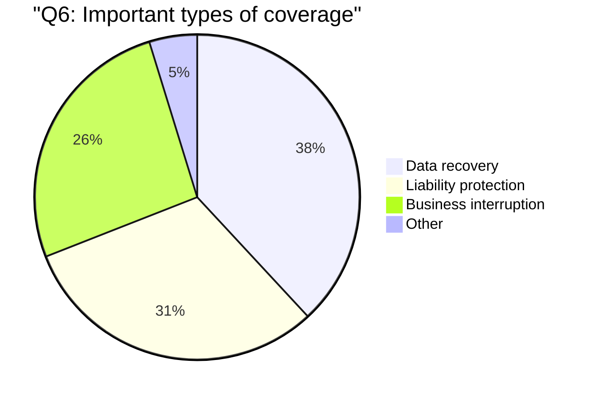
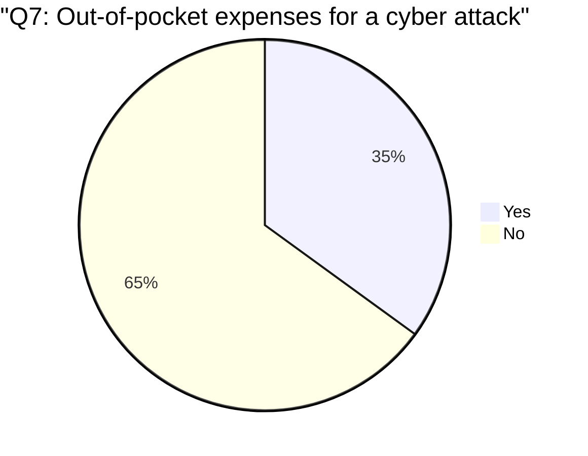

# SEA




 










```mermaid
pie title "Q8: Customer concerns about data security"
  "Yes": 25
  "No": 75
 ```

```mermaid
pie title "Q9: Belief in cyber insurance's impact on recovery time"
  "Significantly faster": 40
  "Somewhat faster": 35
  "No impact on recovery time": 15
  "Unsure": 10
 ```

```mermaid
pie title "Q10: Likelihood of seeking professional advice"
  "Very likely": 50
  "Somewhat likely": 30
  "Not very likely": 15
  "Not at all likely": 5
 ```
